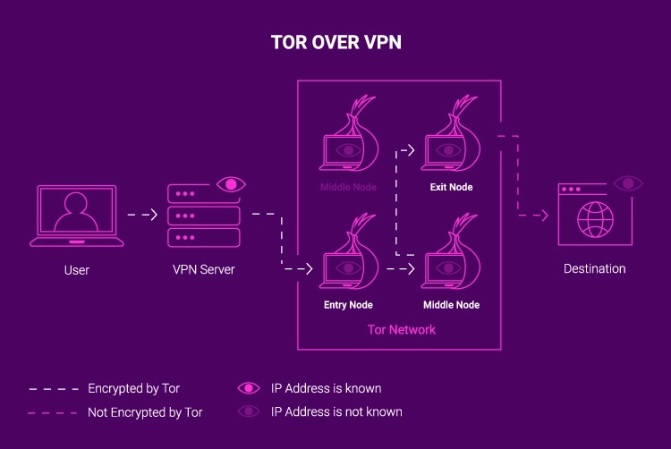

	<h1>Shadow-Gate-VPN 🌐</h1>
	 

## 

  
  
  
  

A high-performance, full-stack VPN extension leveraging the Tor network. Engineered for zero-trust traffic obfuscation and low-latency onion routing.

The idea is:
- VPN hides your real IP from your internet provider
- Tor adds extra anonymity by routing traffic through multiple nodes

---

## What this project includes

- Chrome Extension (UI control panel)
- Background script to manage connection state
- Popup interface (start / stop VPN routing)
- Windows scripts to enable/disable VPN routing
- Tor configuration files

---

## Files explained

- `manifest.json` → Chrome extension setup
- `popup.html / popup.js / popup.css` → UI
- `background.js` → background logic for extension
- `Start-VPN.vbs` → starts VPN + routing setup
- `Stop-VPN.bat` → stops VPN routing
- `Tor/` → Tor configuration files

---

## Requirements

- Windows 10 / 11
- Chrome browser
- VPN client installed (OpenVPN or WireGuard)
- Tor installed and configured

---

## How to use

1. Install the Chrome extension
2. Open the extension popup
3. Click “Start VPN”
4. Traffic is routed through VPN → Tor
5. Click “Stop VPN” to disable routing

---

## Important

- This project only affects Chrome traffic (not full system traffic)
- VPN and Tor must already be installed and configured
- This is a demonstration project, not a production VPN service

---

## Purpose

This project is for learning and demonstrating:
- VPN routing basics
- Tor network integration
- Browser extension control of network tools
